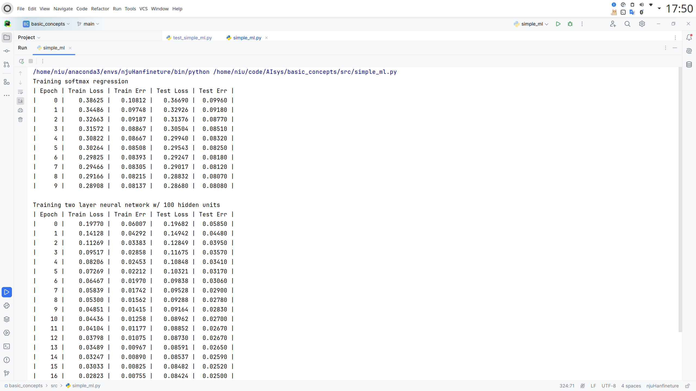

# build basic sys of AI

## Overall
In this project, I explored the fundamental concepts of gradient descent, stochastic gradient descent (SGD), softmax regression, and simple two-layer linear networks, delving into the details behind these techniques. Additionally, I implemented softmax regression in both Python and C++ using pybind11. While proficient libraries like NumPy are typically used for complex matrix computations due to their efficiency, achieving optimal performance often requires leveraging C++ directly, given that NumPy itself is built on C.

## What I learned
* Basic operations with NumPy, including random number generation, dot product calculation, element-wise multiplication, reshaping arrays, and more.
* Integration of C++ code into Python using Pybind11.
## Result
The following picture illustrates the decrease in loss:

